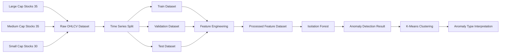

<p align='center'>
    
</p>

<p align="center">
  <h3 align="center">📊 비정상 거래 패턴 탐지 프로젝트</h3>
</p>

<p align="center">
  
</p>
````markdown
# 📈 Financial Anomaly Detection

> 국내 주식 OHLCV 데이터를 활용하여 거래량 급증, 수익률 급변, 변동성 확대, 캔들 패턴 이상 신호를 탐지하고 유형화하는 데이터마이닝 기반 이상 거래 탐지 프로젝트


---

# 1. Background

## 문제 배경

주식시장에서 비정상적인 거래 패턴은 단순한 가격 상승이나 하락만으로 판단하기 어렵다.

특정 종목의 거래량이 갑자기 증가하거나, 단기간 수익률이 급변하거나, 고점 이후 급락이 발생하는 경우에는 시장 참여자 입장에서 이상 징후를 빠르게 파악하는 것이 중요하다.

그러나 실제 금융 데이터는 다음과 같은 특징을 가진다.

- 종목마다 가격 수준과 거래량 규모가 다르다.
- 대형주, 중형주, 소형주의 거래 패턴이 서로 다르다.
- 이상 거래는 명확한 정답 라벨이 없는 경우가 많다.
- 단일 지표만 보면 정상 변동과 이상 변동을 구분하기 어렵다.

기존 방식처럼 “거래량이 많이 늘었다”, “주가가 많이 올랐다” 정도의 단순 기준만 사용하면 종목별 특성과 시간 흐름을 반영하기 어렵다.

따라서 본 프로젝트는 데이터마이닝 기법을 활용하여 여러 금융 지표를 결합하고, 정상 패턴에서 벗어나는 거래 시점을 탐지하는 것을 목표로 한다.

---

# 2. Objective

## 분석 목적

본 프로젝트의 목적은 국내 주식 데이터를 기반으로 비정상 거래 패턴을 탐지하고, 탐지된 이상 거래를 다시 유형별로 구분하는 것이다.

구체적인 목표는 다음과 같다.

1. 국내 상장 종목의 OHLCV 데이터를 수집한다.
2. 거래량, 수익률, 변동성, 캔들 구조를 반영한 파생변수를 생성한다.
3. Isolation Forest를 활용하여 비지도 방식으로 이상 거래 시점을 탐지한다.
4. K-Means Clustering을 활용하여 탐지된 이상 거래를 유형별로 분류한다.
5. 각 클러스터의 특징을 해석하여 실제 금융시장 관점의 인사이트를 도출한다.

---

# 3. Dataset

## 데이터 출처

본 프로젝트는 `yfinance` 라이브러리를 활용하여 국내 주식 종목의 OHLCV 데이터를 수집하였다.

수집 대상은 다음과 같이 구성하였다.

- 대형주: 35개
- 중형주: 35개
- 소형주: 30개
- 총 100개 종목

수집 코드는 `01_step1_data_ingestion.ipynb`에서 확인할 수 있으며, `yfinance`, `pandas`, `numpy`를 사용한다.

노트북에서는 대형주, 중형주, 소형주 티커 리스트를 직접 정의하고, 각 종목별 데이터를 다운로드한 뒤 하나의 데이터프레임으로 통합한다.

---

## 데이터 규모

최종 모델링 단계에서 사용된 파생변수 데이터 기준 규모는 다음과 같다.

| Dataset | Rows | Features used for modeling |
|---|---:|---:|
| Train | 42,317 | 8 |
| Validation | 3,716 | 8 |
| Test | 3,698 | 8 |

모델 입력 변수는 총 8개이며, 결측치 제거와 극단값 완화 후 사용되었다.

---

## 수집 기간

수집 기간은 코드상에서 실행일 기준 전일을 종료일로 설정하고, 약 30개월 전부터 데이터를 수집하도록 정의하였다.

```python
end_date = datetime.today() - timedelta(days=1)
start_date = end_date - timedelta(days=30 * 30)
````

즉, 고정된 과거 기간이 아니라 실행 시점 기준 최근 약 2년 6개월의 데이터를 수집하는 구조이다.

---

## 주요 변수

| 변수                       | 설명                             |
| ------------------------ | ------------------------------ |
| `date`                   | 거래일                            |
| `ticker`                 | 종목 코드                          |
| `group`                  | 종목 규모 구분: Large, Medium, Small |
| `open`                   | 시가                             |
| `high`                   | 고가                             |
| `low`                    | 저가                             |
| `close`                  | 종가                             |
| `adj_close`              | 수정 종가                          |
| `volume`                 | 거래량                            |
| `vol_chg_rate`           | 전일 대비 거래량 변화율                  |
| `volume_ma20_ratio`      | 20일 평균 거래량 대비 현재 거래량 비율        |
| `daily_return`           | 전일 종가 대비 일간 수익률                |
| `volatility_5d`          | 최근 5일 일간 수익률의 표준편차             |
| `drawdown_after_peak_5d` | 최근 5일 고점 대비 현재 종가 하락률          |
| `upper_shadow_ratio`     | 캔들 전체 길이 대비 윗꼬리 비율             |
| `body_ratio`             | 캔들 전체 길이 대비 몸통 비율              |
| `upper_shadow_streak_5d` | 최근 5일 동안 윗꼬리 비율이 높은 날의 누적 횟수   |
| `anomaly_score`          | Isolation Forest 기반 이상치 점수     |
| `anomaly_label`          | 정상/이상 라벨, 정상 0, 이상 1           |
| `cluster`                | 이상 거래 유형 클러스터                  |

---

## 데이터 결합 방식

본 프로젝트는 별도의 외부 데이터셋을 조인한 구조는 아니며, 100개 종목별 OHLCV 데이터를 개별 수집한 뒤 하나의 통합 데이터셋으로 결합하였다.



---

# 4. Problem Formulation

## Instance 정의

본 프로젝트에서 하나의 instance는 다음을 의미한다.

> 특정 종목의 특정 거래일 하루 데이터

즉, 한 행은 “어떤 종목이 특정 날짜에 보인 가격, 거래량, 수익률, 변동성, 캔들 구조”를 나타낸다.

예를 들어 `005930.KS`의 특정 거래일 데이터 한 행은 삼성전자라는 종목이 해당 날짜에 보인 거래 특성을 의미한다.

---

## Input Features

모델에 사용된 입력 변수는 다음 8개이다.

| Feature                  | 의미               |
| ------------------------ | ---------------- |
| `vol_chg_rate`           | 전일 대비 거래량 변화율    |
| `volume_ma20_ratio`      | 20일 평균 대비 거래량 수준 |
| `daily_return`           | 일간 수익률           |
| `volatility_5d`          | 최근 5일 변동성        |
| `drawdown_after_peak_5d` | 최근 고점 대비 하락 정도   |
| `upper_shadow_ratio`     | 장중 상승 후 밀림 정도    |
| `body_ratio`             | 캔들 실체 크기         |
| `upper_shadow_streak_5d` | 최근 윗꼬리 패턴의 반복성   |

이 변수들은 단순 가격 정보만 보는 것이 아니라, 거래량 변화, 가격 변동성, 고점 대비 하락, 캔들 패턴을 함께 반영하기 위해 생성되었다.

---

## Target

본 프로젝트는 명시적인 정답 라벨이 없는 비지도 학습 문제이다.

따라서 사람이 미리 정의한 `fraud`, `manipulation`, `normal` 같은 타깃 라벨을 예측하지 않는다.

대신 Isolation Forest를 이용하여 정상 패턴에서 벗어나는 관측치를 이상 거래 후보로 탐지한다.

최종적으로 생성되는 모델 결과는 다음과 같다.

| Output          | 설명              |
| --------------- | --------------- |
| `anomaly_score` | 이상치 정도를 나타내는 점수 |
| `anomaly_label` | 정상 0, 이상 1      |
| `cluster`       | 이상 거래 후보의 유형    |

---

# 5. Exploratory Data Analysis

EDA는 `03_step3_anomaly_eda_clipping.ipynb`에서 수행되었다.

## 5.1 시장 규모별 데이터 분포

대형주, 중형주, 소형주별 데이터 인스턴스 수를 비교하여 데이터가 특정 그룹에 치우쳐 있는지 확인하였다.

## 5.2 거래량 분포 분석

종목 규모별 거래량 차이가 크기 때문에 거래량은 로그 스케일 박스플롯으로 확인하였다.

이는 거래량 절대값만으로 이상 여부를 판단하면 대형주 중심으로 편향될 수 있음을 보여준다.

## 5.3 일간 수익률 분포

일간 수익률의 밀도 분포를 확인하여 각 그룹별 변동성 차이와 꼬리 위험을 관찰하였다.

주식 데이터에서는 대부분의 수익률이 0 근처에 몰려 있지만, 일부 관측치는 양쪽 꼬리에 위치한다.

## 5.4 거래량 변화율과 변동성 관계

거래량 변화율과 5일 변동성을 함께 시각화하여 거래량 급증과 가격 변동성 확대가 동시에 발생하는 구간을 확인하였다.

## 5.5 캔들 패턴 분석

특정 종목의 OHLCV 캔들 차트를 시각화하여 단순 수치형 변수로만 보기 어려운 장중 가격 움직임을 확인하였다.

## 5.6 변수 간 상관관계

`open`, `high`, `low`, `close`, `volume`, `daily_return`, `volatility_5d` 간 상관관계를 분석하였다.

이를 통해 가격 변수들 간에는 높은 상관이 존재하지만, 거래량과 수익률·변동성 변수는 별도의 정보량을 가질 수 있음을 확인하였다.

## 5.7 이상 패턴 존재 여부 확인

거래량 변화율 분포를 확인하여 극단적인 꼬리값이 존재하는지 검토하였다.

이 과정은 이후 Isolation Forest를 적용할 근거가 된다.

---

# 6. Data Preprocessing

## 6.1 결측치 처리

파생변수를 생성하는 과정에서 이동평균, rolling volatility, 전일 대비 변화율 계산으로 인해 초기 구간에 결측치가 발생한다.

최종 모델링에서는 주요 feature 컬럼 기준으로 결측치를 제거하였다.

```python
df = df.dropna(subset=feature_cols).copy()
```

---

## 6.2 이상치 처리

금융 데이터에서는 거래량 변화율이나 수익률에서 극단값이 발생할 수 있다.

모델이 소수의 극단값에 과도하게 민감해지는 것을 방지하기 위해 각 feature의 1% 분위수와 99% 분위수를 기준으로 clipping을 수행하였다.

```python
lower = df[col].quantile(0.01)
upper = df[col].quantile(0.99)
df[col] = df[col].clip(lower, upper)
```

---

## 6.3 정규화

Isolation Forest와 K-Means 적용 전, feature scale 차이를 완화하기 위해 `StandardScaler`를 적용하였다.

특히 K-Means는 거리 기반 알고리즘이므로 변수 스케일 차이가 클 경우 특정 변수에 과도하게 영향을 받을 수 있다.

---

## 6.4 인코딩

최종 모델에는 수치형 파생변수만 사용하였다.

`ticker`, `group`은 분석 및 해석용 메타 정보로 유지하였으며, 모델 입력 변수에는 포함하지 않았다.

---

# 7. Feature Engineering

본 프로젝트의 핵심은 단순 OHLCV 원천 데이터를 이상 탐지에 적합한 금융 파생변수로 변환하는 것이다.

| Feature                  | 생성 이유                           |
| ------------------------ | ------------------------------- |
| `vol_chg_rate`           | 전일 대비 거래량 급증 여부를 보기 위함          |
| `volume_ma20_ratio`      | 종목별 평소 거래량 대비 현재 거래량이 얼마나 큰지 확인 |
| `daily_return`           | 가격 급등락 여부 측정                    |
| `volatility_5d`          | 단기 변동성 확대 감지                    |
| `drawdown_after_peak_5d` | 최근 고점 이후 급락 패턴 포착               |
| `upper_shadow_ratio`     | 장중 상승 후 매도 압력으로 밀린 패턴 포착        |
| `body_ratio`             | 캔들의 실체 크기로 가격 방향성과 강도 반영        |
| `upper_shadow_streak_5d` | 윗꼬리 패턴이 반복되는지 확인                |

이 변수들은 단일 가격 상승률보다 더 풍부한 정보를 제공한다.

예를 들어 어떤 종목이 단순히 상승한 것인지, 거래량 급증을 동반한 상승인지, 장중 급등 후 밀린 것인지, 최근 고점 대비 급락한 것인지를 구분할 수 있다.

---

# 8. Modeling

## 사용 모델

본 프로젝트에서는 다음 모델을 사용하였다.

| 단계         | 모델                         | 목적                                |
| ---------- | -------------------------- | --------------------------------- |
| Baseline 1 | Isolation Forest, 단일 변수    | `volume_ma20_ratio`만 사용한 단순 이상 탐지 |
| Baseline 2 | Isolation Forest, 다변량      | 여러 파생변수를 사용한 이상 탐지                |
| Main Model | Isolation Forest + K-Means | 이상 거래 탐지 후 이상 유형 군집화              |

---

## 모델 선정 이유

### Isolation Forest

Isolation Forest는 비지도 이상 탐지에 적합한 모델이다.

정상 데이터와 다르게 고립되기 쉬운 관측치를 이상치로 판단한다.

본 프로젝트에서는 명확한 정답 라벨이 없기 때문에 지도학습 분류 모델보다 Isolation Forest가 적합하다.

사용한 주요 설정은 다음과 같다.

```python
IsolationForest(
    n_estimators=200,
    contamination=0.03,
    random_state=42
)
```

`contamination=0.03`은 전체 관측치 중 약 3%를 이상 후보로 간주한다는 의미이다.

---

### K-Means

Isolation Forest는 “이상인지 아닌지”를 탐지할 수 있지만, 이상 거래가 어떤 유형인지까지 설명하기는 어렵다.

따라서 탐지된 이상 거래만 따로 추출한 뒤 K-Means를 적용하여 이상 패턴을 유형화하였다.

K 값은 3부터 8까지 실험하며 inertia와 silhouette score를 비교하였다.

그 결과 `k=3`에서 가장 높은 silhouette score가 확인되어 K-Means의 클러스터 수를 3으로 설정하였다.

---

# 9. Experiment Process

## Baseline 1: 단일 변수 이상 탐지

첫 번째 baseline은 `volume_ma20_ratio` 하나만 사용하였다.

이는 “평소보다 거래량이 비정상적으로 증가한 종목”을 단순하게 찾는 접근이다.

결과는 다음과 같다.

| Label   | Count |
| ------- | ----: |
| Normal  | 7,203 |
| Anomaly |   211 |

단일 변수 모델은 해석이 쉽지만, 가격 변동성이나 캔들 구조를 반영하지 못한다는 한계가 있다.

---

## Baseline 2: 다변량 이상 탐지

두 번째 baseline은 거래량, 수익률, 변동성, 고점 대비 하락, 캔들 패턴 변수를 함께 사용하였다.

이 방식은 단순 거래량 급증뿐 아니라 다음과 같은 복합 패턴을 탐지할 수 있다.

* 거래량 증가 + 가격 급등
* 거래량 증가 + 변동성 확대
* 고점 대비 하락 확대
* 윗꼬리 반복
* 단기 변동성 급증

---

## Main Model: 이상 탐지 + 이상 유형 군집화

최종 모델에서는 다음 순서로 분석을 진행하였다.

1. Train 데이터로 StandardScaler 학습
2. Train, Valid, Test 데이터에 동일한 scaling 적용
3. Isolation Forest로 이상 거래 탐지
4. Test 데이터에서 이상 거래 후보 추출
5. 이상 거래 후보에 K-Means 적용
6. 클러스터별 평균 feature를 분석하여 이상 유형 해석

---

# 10. Results

## Isolation Forest 결과

Test 데이터 기준 결과는 다음과 같다.

| Dataset | Normal | Anomaly |
| ------- | -----: | ------: |
| Test    |  3,539 |     159 |

즉, Test 데이터 3,698개 중 159개가 이상 거래 후보로 탐지되었다.

---

## K-Means 클러스터링 결과

탐지된 이상 거래 후보 159개에 대해 K-Means 클러스터링을 수행하였다.

| Cluster   | Count |
| --------- | ----: |
| Cluster 1 |    69 |
| Cluster 2 |    90 |

코드에서는 `n_clusters=3`으로 설정했지만, Test 이상 거래 후보에 예측된 클러스터는 1번과 2번 중심으로 나타났다.

---

## K 선택 실험 결과

|  k |     Inertia | Silhouette Score |
| -: | ----------: | ---------------: |
|  3 | 1679.513763 |         0.316115 |
|  4 | 1443.162618 |         0.280422 |
|  5 | 1267.439687 |         0.280137 |
|  6 | 1158.514361 |         0.273343 |
|  7 | 1066.787648 |         0.246429 |
|  8 |  972.312830 |         0.265059 |

Silhouette Score 기준으로는 `k=3`이 가장 높은 값을 보였다.

따라서 최종 K-Means 모델에서는 `k=3`을 사용하였다.

---

## 모델 성능 비교

본 프로젝트는 정답 라벨이 없는 비지도 이상 탐지 문제이므로 MAE, RMSE, R²와 같은 회귀 성능 지표는 사용하지 않았다.

대신 이상 탐지 결과 수, 클러스터 해석 가능성, silhouette score를 중심으로 평가하였다.

| Model      | Input                | Evaluation      | Result                   |
| ---------- | -------------------- | --------------- | ------------------------ |
| Baseline 1 | `volume_ma20_ratio`  | 이상 탐지 개수        | 211 anomalies            |
| Main Model | 8 financial features | Test 이상 탐지      | 159 anomalies            |
| K-Means    | Detected anomalies   | Best silhouette | k=3, silhouette 0.316115 |

---

## Best Model

최종 모델은 다음 구조이다.

> StandardScaler → Isolation Forest → Anomaly Filtering → K-Means Clustering

이 모델을 최종 모델로 선정한 이유는 다음과 같다.

1. 정답 라벨이 없는 금융 이상 탐지 문제에 적합하다.
2. 단순 거래량 기준보다 다양한 금융 신호를 함께 반영한다.
3. 이상 거래를 탐지하는 것에서 끝나지 않고, 이상 유형까지 분류할 수 있다.
4. 클러스터별 feature 평균을 통해 결과 해석이 가능하다.

---

# 11. Interpretation

## Cluster 1: 급등·거래량 동반형 이상 패턴

Cluster 1의 주요 특징은 다음과 같다.

| Feature              | Standardized Mean |
| -------------------- | ----------------: |
| `daily_return`       |          1.797597 |
| `volatility_5d`      |          1.011357 |
| `volume_ma20_ratio`  |          0.419185 |
| `vol_chg_rate`       |          0.367444 |
| `upper_shadow_ratio` |         -0.230518 |

Cluster 1은 일간 수익률이 크게 높고, 변동성과 거래량도 함께 증가하는 유형이다.

이는 단기적으로 강한 매수세가 발생한 거래일로 해석할 수 있다.

금융시장 관점에서는 다음과 같은 상황과 연결될 수 있다.

* 호재성 뉴스 발생
* 수급 급증
* 단기 급등 종목
* 거래량을 동반한 가격 상승

---

## Cluster 2: 변동성·하락 위험 확대형 이상 패턴

Cluster 2의 주요 특징은 다음과 같다.

| Feature                  | Standardized Mean |
| ------------------------ | ----------------: |
| `volatility_5d`          |          1.629298 |
| `drawdown_after_peak_5d` |          0.821661 |
| `upper_shadow_streak_5d` |         -0.159773 |
| `upper_shadow_ratio`     |         -0.224986 |
| `body_ratio`             |         -0.582836 |

Cluster 2는 단기 변동성이 크고, 최근 고점 대비 하락 정도가 상대적으로 큰 유형이다.

이는 단순한 급등보다 위험 회피나 가격 불안정성이 강한 패턴으로 해석할 수 있다.

금융시장 관점에서는 다음과 같은 상황과 연결될 수 있다.

* 고점 형성 후 급락
* 단기 변동성 확대
* 매수세 약화
* 불안정한 가격 움직임

---

# 12. Key Insights

본 프로젝트를 통해 얻은 핵심 인사이트는 다음과 같다.

1. 거래량만으로 이상 거래를 판단하는 것은 한계가 있다.
   거래량이 증가하더라도 가격이 상승하는지, 하락하는지, 변동성이 함께 커지는지에 따라 의미가 달라진다.

2. 종목별 평소 거래량 대비 현재 거래량을 보는 것이 중요하다.
   대형주와 소형주는 거래량 절대 규모가 다르기 때문에 `volume_ma20_ratio`처럼 종목 내부 기준의 상대 지표가 필요하다.

3. 이상 거래는 하나의 유형이 아니다.
   본 프로젝트에서는 이상 거래 후보가 “급등·거래량 동반형”과 “변동성·하락 위험 확대형”으로 구분되었다.

4. 비지도 학습은 금융 이상 탐지의 초기 탐색 도구로 유용하다.
   실제 조작 여부나 불공정거래 여부를 단정할 수는 없지만, 위험 후보를 좁히는 데 활용할 수 있다.

---

# 13. Project Story

본 프로젝트는 “주식시장에서 비정상적인 거래 패턴을 데이터마이닝으로 탐지할 수 있을까?”라는 문제의식에서 출발하였다.

초기에는 단순히 거래량이 급증한 종목을 찾는 방식이 가장 직관적인 접근이었다.

하지만 프로젝트를 진행하면서 거래량 하나만으로는 이상 거래를 설명하기 어렵다는 문제가 드러났다.

예를 들어 거래량이 증가했더라도 다음과 같은 경우는 서로 다른 의미를 가진다.

* 거래량 증가와 함께 가격이 급등한 경우
* 거래량 증가 후 가격이 밀린 경우
* 최근 고점 대비 하락이 커진 경우
* 변동성만 확대된 경우
* 윗꼬리가 반복적으로 발생한 경우

따라서 팀은 단일 변수 기반 접근에서 벗어나 다변량 feature engineering을 수행하였다.

거래량 변화율, 20일 평균 대비 거래량, 일간 수익률, 5일 변동성, 최근 고점 대비 하락률, 윗꼬리 비율, 몸통 비율, 윗꼬리 반복 횟수 등을 생성하였다.

모델링 과정에서는 먼저 단일 변수 Isolation Forest를 baseline으로 설정하였다.

이후 여러 파생변수를 함께 사용하는 다변량 Isolation Forest로 확장하였다.

최종적으로는 이상 거래를 탐지하는 것에서 끝나지 않고, 탐지된 이상 거래 후보를 다시 K-Means로 군집화하였다.

이를 통해 단순히 “이상하다”가 아니라 “어떤 유형의 이상 거래인가”를 설명할 수 있도록 프로젝트를 발전시켰다.

---

# 14. Expected Impact

## 경제적 효과

본 프로젝트는 투자 의사결정을 직접 자동화하는 시스템은 아니지만, 이상 거래 후보를 빠르게 선별하는 보조 도구로 활용될 수 있다.

가능한 활용 효과는 다음과 같다.

* 이상 거래 후보 탐색 시간 단축
* 종목 모니터링 효율 개선
* 위험 신호 조기 탐지
* 정량적 기준 기반의 종목 필터링

---

## 운영 효율 개선

금융 데이터 분석 담당자나 투자 리서치 담당자는 수많은 종목을 매일 수작업으로 확인하기 어렵다.

본 프로젝트의 구조를 활용하면 전체 종목 중 이상 패턴을 보이는 거래일만 우선적으로 확인할 수 있다.

---

## 실무 활용 가능성

실무적으로는 다음과 같은 영역에 활용 가능하다.

* 주식 이상 거래 모니터링
* 리스크 관리
* 퀀트 리서치의 사전 필터링
* 금융 데이터마이닝 교육용 프로젝트
* 비지도 이상 탐지 모델 실습

---

# 15. Limitations

본 프로젝트의 한계는 다음과 같다.

1. 정답 라벨이 없다.
   탐지된 이상 거래가 실제 불공정거래나 작전주라는 의미는 아니다.

2. 외부 뉴스 데이터가 반영되지 않았다.
   가격과 거래량의 이상 변동이 기업 실적, 공시, 정책, 산업 이슈 때문인지 구분하기 어렵다.

3. 종목 universe가 제한적이다.
   전체 상장 종목이 아니라 100개 종목을 대상으로 분석하였다.

4. `contamination=0.03`은 실험적으로 설정된 값이다.
   실제 시장에서 이상 거래 비율이 항상 3%라고 볼 수는 없다.

5. K-Means는 구형 군집을 가정한다.
   금융 이상 패턴이 복잡한 비선형 구조를 가진다면 K-Means만으로 충분하지 않을 수 있다.

---

# 16. Future Work

추후 개선 방향은 다음과 같다.

1. 뉴스, 공시, 검색량 데이터 결합
   가격·거래량 이상 변동의 원인을 해석하기 위해 외부 이벤트 데이터를 결합할 수 있다.

2. 전체 상장 종목으로 확장
   KOSPI, KOSDAQ 전체 종목으로 분석 범위를 확대할 수 있다.

3. 모델 다양화
   Local Outlier Factor, One-Class SVM, AutoEncoder 등 다른 이상 탐지 모델과 비교할 수 있다.

4. 이상 탐지 기준 검증
   실제 거래정지, 투자주의, 투자경고, 공시 이벤트와 비교하여 모델 결과를 검증할 수 있다.

5. 대시보드 구축
   Streamlit 또는 Dash를 활용하여 종목별 이상 신호를 시각적으로 확인할 수 있는 대시보드를 만들 수 있다.

6. SHAP 기반 해석 추가
   Tree 기반 모델이나 surrogate model을 활용하여 이상 점수에 영향을 준 변수를 더 명확히 설명할 수 있다.

---

# 17. Repository Structure

```bash
financial-anomaly-detection/
│
├── data/
│   └── processed/
│       ├── anomaly_cluster_result.csv
│       ├── cluster_profile_raw.csv
│       ├── cluster_profile_scaled.csv
│       ├── test_features.csv
│       ├── train_features.csv
│       └── valid_features.csv
│
├── notebooks/
│   ├── 01_step1_data_ingestion.ipynb
│   ├── 02_step2_time_series_split.ipynb
│   ├── 03_step3_anomaly_eda_clipping.ipynb
│   ├── 04_step4_multivariate_feature_engineering.ipynb
│   ├── 05_step5.1_base_model_1.ipynb
│   ├── 05_step5.2_base_model_2.ipynb
│   ├── 06_step6_main_model.ipynb
│   └── 06_step6_main_model_.ipynb
│
├── results/
│   └── figures/
│       ├── base_model1_result.png
│       ├── base_model2_result.png
│       ├── eda2_volume_distribution.png
│       ├── eda3_volatility_distribution.png
│       ├── eda4_volume_vs_volatility_en.png
│       ├── eda5_candlestick_anomaly_en.png
│       ├── eda6_feature_correlation_en.png
│       └── eda7_anomaly_existence_en.png
│
├── .gitignore
├── LICENSE
└── README.md
```

---

# 18. How To Run

## 18.1 Repository Clone

```bash
git clone https://github.com/leessanghu/financial-anomaly-detection.git
cd financial-anomaly-detection
```

---

## 18.2 Install Packages

```bash
pip install pandas numpy matplotlib seaborn scikit-learn yfinance mplfinance
```

---

## 18.3 Run Notebooks in Order

아래 순서대로 노트북을 실행한다.

```bash
notebooks/01_step1_data_ingestion.ipynb
notebooks/02_step2_time_series_split.ipynb
notebooks/03_step3_anomaly_eda_clipping.ipynb
notebooks/04_step4_multivariate_feature_engineering.ipynb
notebooks/05_step5.1_base_model_1.ipynb
notebooks/05_step5.2_base_model_2.ipynb
notebooks/06_step6_main_model.ipynb
```

---

## 18.4 Output Files

실행 후 주요 결과는 다음 위치에 저장된다.

```bash
data/processed/anomaly_cluster_result.csv
data/processed/cluster_profile_raw.csv
data/processed/cluster_profile_scaled.csv
results/figures/
```

---

# 19. Team Members

| Name         | Role                                               |
| ------------ | -------------------------------------------------- |
| leessanghu   | Repository owner, data mining pipeline development |
| Team Members | 데이터 수집, EDA, 피처 엔지니어링, 모델링, 결과 해석                  |

현재 GitHub Repository에서 명확히 확인 가능한 계정은 `leessanghu`이다.

추가 팀원 이름은 발표자료 또는 팀 정보가 확인되는 경우 업데이트할 수 있다.

---

# 20. References

* yfinance Documentation
  https://ranaroussi.github.io/yfinance/

* scikit-learn IsolationForest
  https://scikit-learn.org/stable/modules/generated/sklearn.ensemble.IsolationForest.html

* scikit-learn KMeans
  https://scikit-learn.org/stable/modules/generated/sklearn.cluster.KMeans.html

* scikit-learn silhouette_score
  https://scikit-learn.org/stable/modules/generated/sklearn.metrics.silhouette_score.html

* GitHub Repository
  https://github.com/leessanghu/financial-anomaly-detection

---

# 21. Conclusion

본 프로젝트는 국내 주식 OHLCV 데이터를 활용하여 비정상 거래 패턴을 탐지하고 유형화한 데이터마이닝 프로젝트이다.

단순히 거래량이 증가한 종목을 찾는 수준이 아니라, 거래량 변화율, 평균 거래량 대비 비율, 일간 수익률, 단기 변동성, 고점 대비 하락률, 캔들 패턴을 함께 반영하였다.

최종적으로 Isolation Forest를 통해 이상 거래 후보를 탐지하고, K-Means를 통해 이상 거래를 유형별로 분류하였다.

그 결과 이상 거래 후보는 크게 급등·거래량 동반형 패턴과 변동성·하락 위험 확대형 패턴으로 해석할 수 있었다.

본 프로젝트는 정답 라벨이 없는 금융 데이터에서 비지도 학습을 활용해 현실적인 이상 탐지 문제를 해결했다는 점에서 의미가 있다.

향후 뉴스, 공시, 투자경고 데이터와 결합한다면 실제 금융 리스크 모니터링 시스템으로 확장할 수 있다.

```
```
