<p align='center'>
    
</p>


---

## 📌 Project Overview

> **OHLCV 기반 주식 데이터를 활용하여 비정상 거래 패턴을 탐지하고, 탐지된 이상 거래를 유형별로 해석하는 데이터마이닝 프로젝트**

본 프로젝트는 단순히 거래량이 급증한 종목을 찾는 것을 넘어, 거래량·수익률·변동성·캔들 형태·고점 이후 하락폭을 함께 고려하여 **비정상 거래 패턴을 탐지하고 유형화**하는 것을 목표로 한다.

주식시장에서 거래량 급증은 투자자들이 가장 직관적으로 확인하는 신호 중 하나이다. 그러나 모든 거래량 증가는 긍정적인 신호가 아니며, 일부 종목에서는 거래량 증가와 함께 고점 물량 처분, 단기 과열, 급등 후 급락과 같은 위험 패턴이 나타날 수 있다.

따라서 본 프로젝트는 데이터마이닝 방법론을 활용하여 다음 질문에 답하고자 한다.

> **“거래량 급증 종목 중에서 실제로 위험한 비정상 거래 패턴을 어떻게 구분할 수 있을까?”**

---

## 발표 및 README 구성 흐름

본 README는 발표자료와 동일한 흐름으로 구성하였다.

1. 분석 배경 및 필요성
2. 분석 목적
3. 데이터 수집
4. EDA
5. 피처 엔지니어링
6. Baseline Model 1
7. Baseline Model 2
8. Main Model V1
9. Main Model V2
10. 모델 최종 선택 및 결과
11. 군집별 대응 방안 및 활용 방안
12. 기대 효과
13. 한계점 및 추후 개선 방향

---

## Table of Contents

* [1. 분석 배경 및 필요성](#1-분석-배경-및-필요성)
* [2. 분석 목적](#2-분석-목적)
* [3. 데이터 수집](#3-데이터-수집)
* [4. Problem Formulation](#4-problem-formulation)
* [5. EDA](#5-eda)
* [6. Feature Engineering](#6-feature-engineering)
* [7. Baseline Model 1](#7-baseline-model-1)
* [8. Baseline Model 2](#8-baseline-model-2)
* [9. Main Model V1](#9-main-model-v1)
* [10. Main Model V2](#10-main-model-v2)
* [11. 모델 최종 선택 및 결과](#11-모델-최종-선택-및-결과)
* [12. 군집별 대응 방안 및 활용 방안](#12-군집별-대응-방안-및-활용-방안)
* [13. 기대 효과](#13-기대-효과)
* [14. 한계점 및 추후 개선 방향](#14-한계점-및-추후-개선-방향)
* [15. Repository Structure](#15-repository-structure)
* [16. How to Run](#16-how-to-run)
* [17. References](#17-references)
* [18. Caution](#18-caution)
* [Conclusion](#conclusion)

---

# 1. 분석 배경 및 필요성

## 1.1 문제 배경

주식시장에서 투자자들은 거래량이 급증한 종목을 중요한 투자 신호로 활용한다.

거래량 증가는 다음과 같은 의미를 가질 수 있다.

| 의미           | 설명                          |
| ------------ | --------------------------- |
| 시장 관심 증가     | 특정 종목에 대한 투자자 관심이 증가한 상태    |
| 호재성 뉴스       | 실적, 정책, 공시 등 긍정적 이벤트 발생 가능성 |
| 기관·외국인 수급 유입 | 대규모 자금이 유입되었을 가능성           |
| 단기 과열        | 투기적 수요가 단기간 집중된 상태          |
| 물량 처분 가능성    | 고점에서 매도 압력이 발생했을 가능성        |

그러나 모든 거래량 증가는 긍정적인 신호가 아니다.

일부 종목에서는 거래량 급증과 함께 다음과 같은 위험 패턴이 나타난다.

* 고점에서 긴 윗꼬리 발생
* 최근 며칠 동안 윗꼬리 반복
* 단기 급등 이후 급락
* 거래량 급증에도 가격 상승 지속 실패
* 고점 대비 큰 하락폭 발생

특히 개인 투자자는 단순히 “거래량이 터졌다”는 사실만 보고 투자 판단을 내리는 경우가 많다. 하지만 거래량 증가가 정상적인 관심 증가인지, 비정상적인 물량 처분 신호인지 구분하기는 어렵다.

---

## 1.2 기존 방법의 한계

기존 투자 판단에서는 주로 다음과 같은 단일 지표가 활용된다.

| 기존 지표       | 한계                          |
| ----------- | --------------------------- |
| 거래량 증가 여부   | 거래량 증가의 원인을 구분하기 어려움        |
| 당일 수익률      | 단기 상승과 위험 신호를 구분하기 어려움      |
| 이동평균선 이탈 여부 | 가격 흐름만 반영하고 거래 구조를 설명하기 어려움 |
| 단순 변동성      | 어떤 유형의 이상 패턴인지 해석하기 어려움     |

실제 시장에서는 거래량, 가격 변동성, 캔들 형태, 고점 이후 하락폭 등 여러 요소가 복합적으로 작용한다.

따라서 단일 지표만으로는 비정상 거래 패턴을 충분히 설명하기 어렵다.

---

# 2. 분석 목적

본 프로젝트의 목적은 단순히 거래량이 급증한 종목을 찾는 것이 아니다.

핵심 목표는 **비정상 거래 후보를 탐지하고, 탐지된 이상 거래를 의미 있는 거래 패턴으로 유형화하여 해석하는 것**이다.

## 2.1 프로젝트 목표

1. 국내 주식 OHLCV 데이터를 수집한다.
2. 거래량, 수익률, 변동성, 캔들 형태를 반영한 파생 피처를 생성한다.
3. 비지도학습 기반 이상치 탐지 모델을 활용하여 비정상 거래 후보를 탐지한다.
4. 탐지된 이상치를 군집화하여 거래 패턴을 유형별로 분류한다.
5. 군집별 특성을 해석하여 투자 위험 신호 및 활용 방안을 제안한다.

---

## 2.2 핵심 분석 질문

| 분석 질문                                  | 접근 방식                                |
| -------------------------------------- | ------------------------------------ |
| 거래량이 급증한 종목은 모두 위험한가?                  | Baseline 1을 통해 거래량 단일 변수의 한계 확인      |
| 전체 거래 데이터를 바로 군집화하면 의미 있는 이상 패턴이 나오는가? | Baseline 2를 통해 이상치 탐지 단계의 필요성 검증     |
| 다변수 이상치 탐지 후 군집화하면 어떤 패턴이 나타나는가?       | Main Model V1을 통해 이상 거래 유형화          |
| 군집을 구분하는 핵심 변수는 무엇인가?                  | Random Forest Feature Importance로 해석 |
| 실제로 어떻게 활용할 수 있는가?                     | 군집별 대응 방안 및 모니터링 활용 방안 제시            |

---

# 3. 데이터 수집

## 3.1 데이터 개요

본 프로젝트는 국내 상장 종목의 일별 OHLCV 데이터를 기반으로 분석을 수행하였다.

OHLCV는 다음 정보를 의미한다.

| 항목     | 의미  |
| ------ | --- |
| Open   | 시가  |
| High   | 고가  |
| Low    | 저가  |
| Close  | 종가  |
| Volume | 거래량 |

각 데이터는 특정 종목의 특정 거래일을 하나의 관측치로 가진다.

---

## 3.2 기업 선정 기준

본 프로젝트에서는 모델 학습에 활용 가능한 충분한 거래 이력이 존재하는 국내 상장 종목을 대상으로 데이터를 구성하였다.

기업 선정 과정에서는 다음 기준을 고려하였다.

| 기준              | 설명                                             |
| --------------- | ---------------------------------------------- |
| 데이터 수집 가능성      | OHLCV 데이터가 안정적으로 수집 가능한 종목                     |
| 거래 이력 충분성       | 분석 기간 동안 충분한 일별 거래 데이터가 존재하는 종목                |
| 결측치 및 이상 결측 최소화 | 거래정지, 상장폐지, 데이터 누락이 과도하지 않은 종목                 |
| 시장 패턴 다양성       | 일반 거래, 거래량 증가, 변동성 확대 등 다양한 거래 패턴을 포함할 수 있는 종목 |

즉, 특정 기업의 재무 우수성을 평가하기보다는 **비정상 거래 패턴 탐지 모델을 학습하기에 적절한 시계열 거래 데이터가 확보되는 종목**을 중심으로 데이터를 구성하였다.

---

## 3.3 데이터 분할

금융 데이터는 시간 순서가 중요한 시계열 데이터이다.

따라서 본 프로젝트에서는 임의의 랜덤 분할이 아니라, 시간 순서를 고려하여 Train, Validation, Test 데이터를 분리하였다.

| Dataset    | 역할                                   |
| ---------- | ------------------------------------ |
| Train      | 피처 생성 기준 산출, 이상치 탐지 모델 학습, KMeans 학습 |
| Validation | Threshold 및 모델 구조 검토                 |
| Test       | 최종 모델의 일반화 가능성 확인                    |

---

## 3.4 Data Leakage 방지

본 프로젝트에서는 미래 데이터의 정보가 학습 과정에 반영되지 않도록 Data Leakage 방지를 중요하게 고려하였다.

특히 다음 과정은 모두 Train 데이터 기준으로만 수행하였다.

* Scaler 학습
* Z-score 기준 산출
* Isolation Forest threshold 설정
* KMeans 학습
* 군집 중심점 학습

Validation/Test 데이터에는 Train에서 학습된 scaler와 model을 그대로 적용하였다.

이는 Validation/Test 데이터의 분포 정보가 학습 과정에 반영되는 것을 방지하기 위함이다.

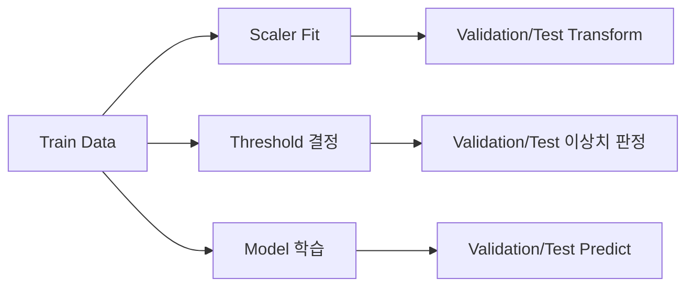
```mermaid
flowchart LR
    A[Train Data] --> B[Scaler Fit]
    A --> C[Threshold 결정]
    A --> D[Model 학습]
    B --> E[Validation/Test Transform]
    C --> F[Validation/Test 이상치 판정]
    D --> G[Validation/Test Predict]
```

---

## 3.5 생성된 데이터 파일

`data/processed` 폴더에는 전처리 및 모델링에 사용된 데이터가 저장되어 있다.

| 파일명                          | 설명                       |
| ---------------------------- | ------------------------ |
| `train_features.csv`         | Train 구간의 파생 피처 데이터      |
| `valid_features.csv`         | Validation 구간의 파생 피처 데이터 |
| `test_features.csv`          | Test 구간의 파생 피처 데이터       |
| `anomaly_cluster_result.csv` | 이상치 탐지 및 군집화 결과          |
| `cluster_profile_raw.csv`    | 군집별 원본 스케일 평균값           |
| `cluster_profile_scaled.csv` | 군집별 표준화 스케일 평균값          |

---

# 4. Problem Formulation

## 4.1 Instance 정의

본 프로젝트에서 하나의 instance는 다음을 의미한다.

> **특정 종목의 특정 거래일**

예시는 다음과 같다.

| ticker    | date       | 의미                |
| --------- | ---------- | ----------------- |
| 008930.KS | 2024-07-04 | 특정 종목의 특정 거래일 데이터 |
| 207940.KS | 2025-05-19 | 특정 종목의 특정 거래일 데이터 |

즉, 각 행은 하나의 종목-거래일 단위의 거래 사례이다.

---

## 4.2 Input Features

OHLCV 데이터를 기반으로 다음 8개의 주요 피처를 생성하였다.

| Feature                  | 의미                  | 해석                   |
| ------------------------ | ------------------- | -------------------- |
| `volume_ma20_ratio`      | 거래량 / 최근 20일 평균 거래량 | 평소 대비 거래량 증가 정도      |
| `vol_chg_rate`           | 전일 대비 거래량 변화율       | 전일 대비 거래량 급증 여부      |
| `daily_return`           | 전일 대비 수익률           | 당일 가격 변화             |
| `volatility_5d`          | 최근 5일 변동성           | 단기 가격 변동성            |
| `drawdown_after_peak_5d` | 최근 고점 대비 하락폭        | 고점 이후 하락 위험          |
| `upper_shadow_ratio`     | 윗꼬리 비율              | 고점에서 매도 압력이 있었는지     |
| `body_ratio`             | 캔들 몸통 비율            | 장중 가격 변화가 종가에 반영된 정도 |
| `upper_shadow_streak_5d` | 최근 5일 긴 윗꼬리 반복 횟수   | 반복적인 고점 매도 압력        |

---

## 4.3 Output

본 프로젝트는 실제 불공정거래 여부에 대한 정답 Label이 없는 비지도학습 기반 분석이다.

따라서 Output은 특정 종목이 실제 작전주인지 여부가 아니라, 모델이 분류한 **비정상 거래 패턴 유형**이다.

| Output    | 의미        |
| --------- | --------- |
| Cluster 0 | 특수 거래 패턴형 |
| Cluster 1 | 차익실현 압력형  |
| Cluster 2 | 강한 수급 유입형 |

---

## 4.4 분석 목표

본 프로젝트의 분석 목표는 다음과 같다.

> **거래량 급증 종목을 단순 탐지하는 것이 아니라, 비정상 거래 패턴을 의미 있는 유형으로 분류하고 해석하는 것**

---

# 5. EDA

EDA 단계에서는 데이터의 분포와 이상 거래 후보의 특성을 확인하였다.

## 5.1 EDA 목적

EDA는 단순히 시각화를 위한 단계가 아니라, 이후 모델링에 사용할 피처가 실제로 필요한지 확인하기 위한 과정이다.

| EDA 항목     | 목적                       |
| ---------- | ------------------------ |
| 거래량 분포 확인  | 거래량 급증 구간이 존재하는지 확인      |
| 변동성 분포 확인  | 단기 변동성이 큰 종목 존재 여부 확인    |
| 거래량-변동성 관계 | 거래량 증가가 변동성 확대와 연결되는지 확인 |
| 캔들 패턴 확인   | 윗꼬리, 몸통 등 가격 행동 패턴 확인    |
| 피처 상관관계 확인 | 피처 간 중복성과 보완 관계 확인       |

---

## 5.2 주요 EDA 결과

EDA를 통해 다음과 같은 점을 확인하였다.

1. 대부분의 일반 거래는 평소 거래량 수준에 밀집되어 있다.
2. 일부 거래일에서는 20일 평균 대비 매우 큰 거래량 증가가 관찰된다.
3. 거래량 증가가 항상 수익률 상승으로 이어지지는 않는다.
4. 거래량 급증 구간 중 일부는 긴 윗꼬리와 함께 나타난다.
5. 고점 이후 하락폭과 캔들 형태는 이상 거래 패턴 해석에 중요한 정보를 제공한다.

---

## 5.3 EDA 시각화 자료

아래 이미지는 EDA 과정에서 생성된 주요 시각화 자료이다.

<details>
<summary>EDA 시각화 자료 보기</summary>

<p align="center">
  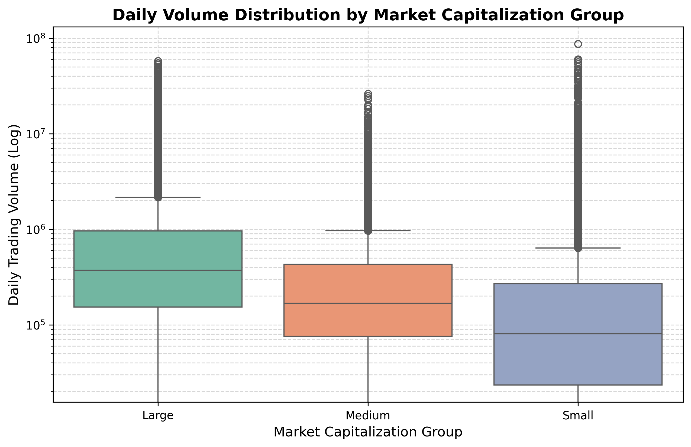
</p>
<p align="center"><b>EDA 1. Volume Distribution</b></p>

<p align="center">
  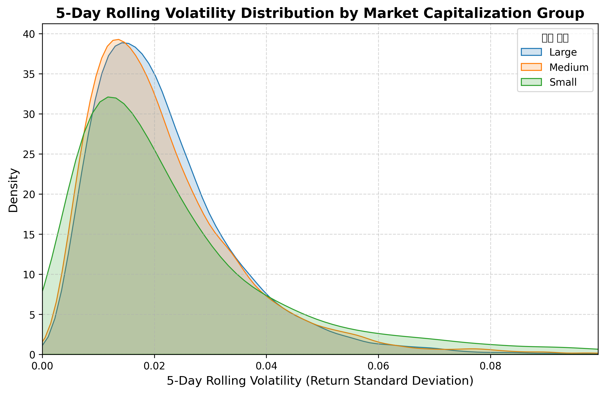
</p>
<p align="center"><b>EDA 2. Volatility Distribution</b></p>

<p align="center">
  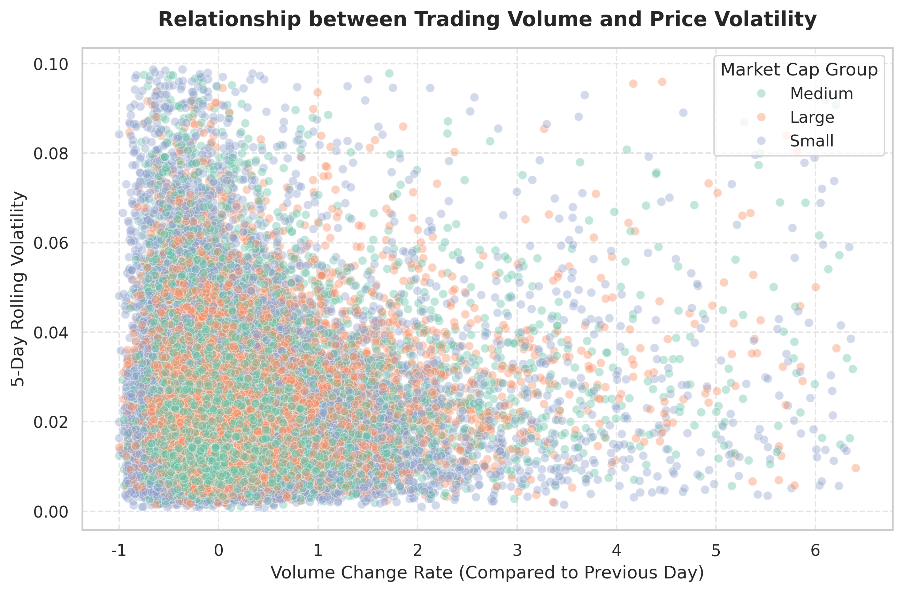
</p>
<p align="center"><b>EDA 3. Volume vs Volatility</b></p>

<p align="center">
  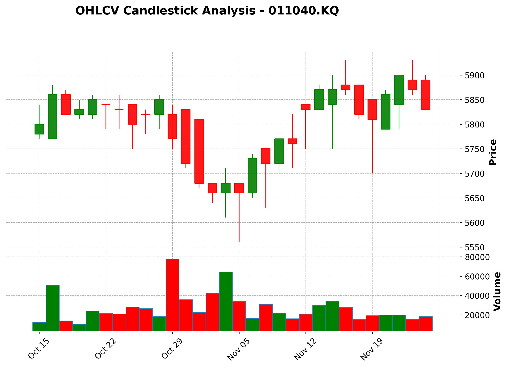
</p>
<p align="center"><b>EDA 4. Candlestick Anomaly</b></p>

<p align="center">
  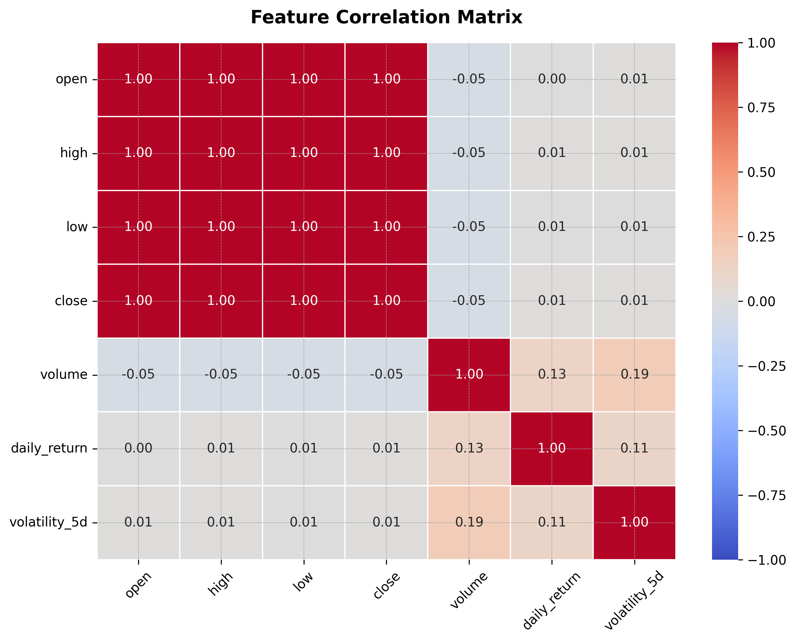
</p>
<p align="center"><b>EDA 5. Feature Correlation</b></p>

</details>

---

# 6. Feature Engineering

본 프로젝트의 핵심은 단순 OHLCV 값을 그대로 사용하는 것이 아니라, 비정상 거래 패턴을 설명할 수 있는 파생 변수를 생성하는 것이다.

## 6.1 거래량 기반 피처

### `volume_ma20_ratio`

최근 20일 평균 거래량 대비 당일 거래량이 얼마나 증가했는지를 나타낸다.

```text
volume_ma20_ratio = 당일 거래량 / 최근 20일 평균 거래량
```

예를 들어 `volume_ma20_ratio = 4`라면, 당일 거래량이 최근 20일 평균의 4배라는 뜻이다.

---

### `vol_chg_rate`

전일 대비 거래량 변화율이다.

```text
vol_chg_rate = 당일 거래량 / 전일 거래량
```

전일 대비 갑작스럽게 거래량이 증가했는지 확인하는 데 사용된다.

---

## 6.2 가격 변화 기반 피처

### `daily_return`

전일 대비 수익률이다.

```text
daily_return = (당일 종가 - 전일 종가) / 전일 종가
```

거래량 증가가 실제 가격 상승으로 이어졌는지 확인하는 데 사용된다.

---

### `volatility_5d`

최근 5일 수익률의 변동성이다.

단기적으로 주가 움직임이 불안정한 종목을 탐지하는 데 활용된다.

---

### `drawdown_after_peak_5d`

최근 5일 고점 대비 현재 가격이 얼마나 하락했는지를 나타낸다.

```text
drawdown_after_peak_5d = 현재 종가 / 최근 5일 최고가 - 1
```

이 값이 음수로 크게 나타날수록 최근 고점 대비 낙폭이 크다는 의미이다.

---

## 6.3 캔들 구조 기반 피처

### `upper_shadow_ratio`

캔들에서 윗꼬리가 차지하는 비율이다.

윗꼬리가 길다는 것은 장중 고점까지 상승했지만, 종가 기준으로는 상승분을 유지하지 못했다는 뜻이다.

이는 고점 부근에서 매도 압력이 강했음을 의미할 수 있다.

---

### `body_ratio`

캔들 몸통의 비율이다.

시가와 종가 사이의 변화가 전체 가격 변동에서 어느 정도를 차지하는지 나타낸다.

---

### `upper_shadow_streak_5d`

최근 5일 동안 긴 윗꼬리가 반복적으로 발생한 횟수이다.

단발성 윗꼬리보다 반복적인 윗꼬리는 고점에서 지속적인 매도 압력이 발생했을 가능성을 보여준다.

---

# 7. Baseline Model 1

## 7.1 모델 개요

Baseline Model 1은 가장 직관적인 이상 신호인 **거래량**만을 기준으로 이상치를 탐지하는 단순 모델이다.

투자자들이 경험적으로 알고 있는 “거래량이 터지면 위험하다”는 정성적 인식을 가장 간단하게 정량화한 모델이다.

## 7.2 모델 구조

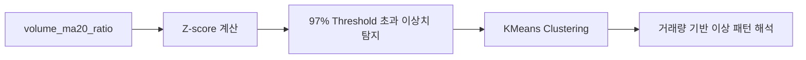
```mermaid
flowchart LR
    A[volume_ma20_ratio] --> B[Z-score 계산]
    B --> C[97% Threshold 초과 이상치 탐지]
    C --> D[KMeans Clustering]
    D --> E[거래량 기반 이상 패턴 해석]
```

<p align="center">
  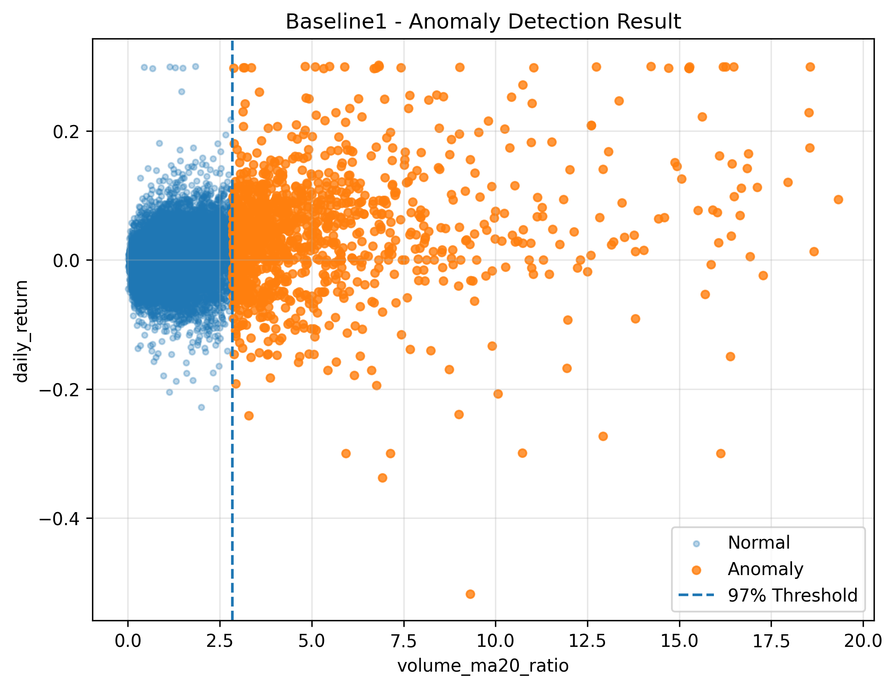
</p>
<p align="center"><b>Figure 1. Baseline 1 Anomaly Detection Result</b></p>

위 시각화는 `volume_ma20_ratio`를 기준으로 97% threshold를 초과한 거래를 이상치로 탐지한 결과이다. 대부분의 정상 거래는 낮은 거래량 비율 구간에 밀집되어 있으며, 이상치로 탐지된 거래는 평소 대비 거래량이 크게 증가한 구간에 분포한다.

다만 이상치 내부에서도 `daily_return`이 양수인 경우와 음수인 경우가 함께 나타나므로, 거래량 단일 변수만으로는 상승형 이상 거래와 위험형 이상 거래를 구분하기 어렵다.

---

## 7.3 Threshold 및 K 선택

Threshold 후보는 95%, 97%, 99%를 검토하였다.

95% 기준은 Silhouette Score가 더 높게 나타났지만, 전체 데이터 상위 5%를 이상치로 간주하기 때문에 일반적인 거래 활황 구간까지 포함할 가능성이 있었다.

본 프로젝트의 목적은 단순 거래량 증가가 아니라 **비정상 거래 패턴 탐지**이므로, 이상치 순도를 높이기 위해 더 보수적인 97% Threshold를 최종 선택하였다.

| 구분     | Threshold |    이상치 수 |  K | Silhouette |
| ------ | --------: | -------: | -: | ---------: |
| Case 1 |       95% | 약 2,120개 |  3 |      0.400 |
| Case 2 |       97% |   1,272개 |  3 |      0.275 |

---

## 7.4 Baseline 1 결과

<p align="center">
  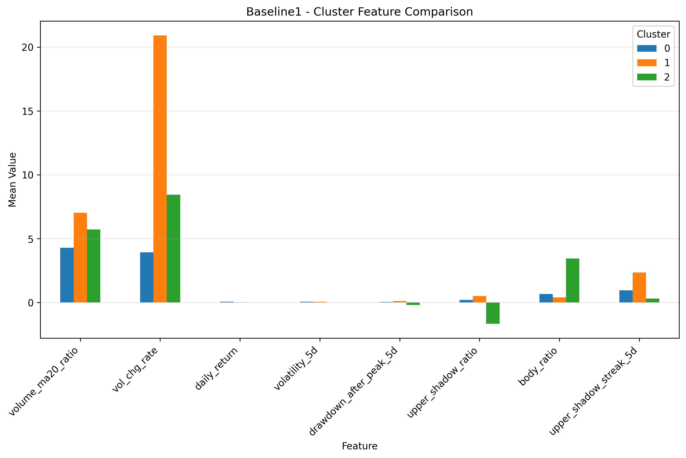
</p>
<p align="center"><b>Figure 2. Baseline 1 Cluster Feature Comparison</b></p>

이 그림은 Baseline 1에서 탐지된 이상치를 KMeans로 군집화한 뒤, 각 군집의 주요 피처 평균을 비교한 결과이다. 거래량 기반 이상치 안에서도 `vol_chg_rate`, `upper_shadow_ratio`, `body_ratio`, `upper_shadow_streak_5d` 등이 다르게 나타나므로, 거래량 이상치 내부에도 서로 다른 패턴이 존재함을 확인할 수 있다.

<p align="center">
  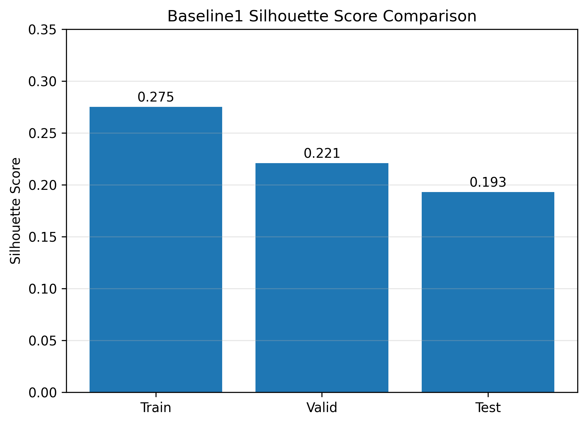
</p>
<p align="center"><b>Figure 3. Baseline 1 Silhouette Score Comparison</b></p>

Baseline 1의 Silhouette Score는 Train 0.275, Validation 0.221, Test 0.193으로 나타났다. 이는 거래량 단일 변수 기반 이상치 탐지가 일정 수준의 군집 구조는 만들 수 있지만, 복합적인 이상 거래 패턴을 안정적으로 구분하기에는 한계가 있음을 보여준다.

Train 데이터에서 97% Threshold를 적용한 결과 1,272개의 이상치가 탐지되었다.

탐지된 이상치를 공통 8개 피처로 KMeans K=3 군집화한 결과 다음과 같은 패턴이 도출되었다.

| Cluster   | 해석           |
| --------- | ------------ |
| Cluster 0 | 강한 수급 유입형    |
| Cluster 1 | 차익실현 압력형     |
| Cluster 2 | 소수 특수 거래 패턴형 |

---

## 7.5 Baseline 1 한계

Baseline 1은 거래량이라는 단 하나의 신호만으로 이상치를 탐지한다.

따라서 거래량이 증가한 것이 단순 호재성 뉴스로 인한 정상적 상승인지, 고점 물량 처분이 동반된 위험한 패턴인지 구분하기 어렵다.

즉, 거래량 단일 변수는 이상 거래 탐지의 출발점은 될 수 있지만, 복합적인 이상 패턴을 설명하기에는 한계가 있다.

---

# 8. Baseline Model 2

## 8.1 모델 개요

Baseline Model 2는 이상치 탐지 단계 없이 전체 데이터를 바로 KMeans로 군집화하는 모델이다.

이 모델은 다음 질문을 확인하기 위해 설계되었다.

> **“이상치 탐지 단계를 거치지 않고 전체 데이터를 바로 군집화해도 의미 있는 이상 패턴이 도출되는가?”**

---

## 8.2 모델 구조


```mermaid
flowchart LR
    A[전체 데이터] --> B[Scaling]
    B --> C[KMeans Clustering]
    C --> D[전체 거래 패턴 군집화]
```

---

## 8.3 K 선택 및 결과

<p align="center">
  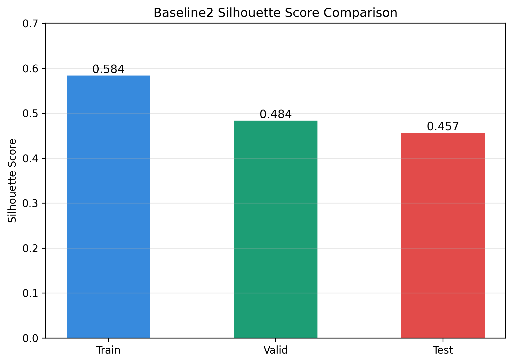
</p>
<p align="center"><b>Figure 4. Baseline 2 Silhouette Score Comparison</b></p>

Baseline 2는 전체 데이터를 바로 KMeans로 군집화했기 때문에 Baseline 1보다 높은 Silhouette Score를 보였다. 그러나 전체 데이터의 대부분이 일반 거래 군집에 집중되므로, 점수는 높더라도 비정상 거래 내부의 세부 유형을 해석하는 데에는 한계가 있다.

K=2~8 범위에서 탐색한 결과 K=2가 높은 Silhouette Score를 보였다.

그러나 군집 분포를 확인한 결과, 전체 데이터 대부분이 하나의 군집에 집중되는 문제가 있었다.

| K=2 결과    |   군집 크기 |      비율 |
| --------- | ------: | ------: |
| Cluster 0 | 42,210개 | 약 99.6% |
| Cluster 1 |    186개 |  약 0.4% |

K=2에서는 정상 데이터와 극단 패턴의 단순 이분법적 분리만 이루어졌기 때문에, 거래 패턴을 세부적으로 해석하기 어려웠다.

따라서 해석 가능성을 고려하여 K=3 결과도 함께 검토하였다.

| K=3 결과    |   군집 크기 | 해석        |
| --------- | ------: | --------- |
| Cluster 0 |  2,311개 | 거래량 증가형   |
| Cluster 1 | 39,899개 | 일반 거래형    |
| Cluster 2 |    186개 | 극단 특이 패턴형 |

---

## 8.4 Baseline 2 한계

Baseline 2의 핵심 한계는 전체 데이터의 대다수가 일반 거래형 군집에 집중된다는 점이다.

수치상 Silhouette Score는 높게 나타날 수 있지만, 이는 일반 거래 데이터가 하나의 군집으로 깔끔하게 묶였기 때문이며, 본 프로젝트의 목적인 **비정상 거래 내부 패턴 세분화**와는 거리가 있다.

따라서 이상 거래 후보를 먼저 탐지한 뒤, 그 안에서 패턴을 세분화하는 Main Model이 필요하다.

---

# 9. Main Model V1

## 9.1 모델 개요

Main Model V1은 본 프로젝트의 최종 모델이다.

단일 변수 기반 탐지와 전체 데이터 군집화의 한계를 극복하기 위해 다음 세 단계 파이프라인을 적용하였다.

1. **Isolation Forest**: 8개 피처를 기반으로 다변수 이상치 탐지
2. **DBSCAN**: 탐지된 이상치 중 노이즈 제거
3. **KMeans**: 정제된 이상치를 대상으로 세부 패턴 군집화

---

## 9.2 모델 구조

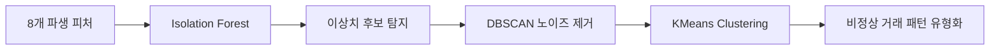
```mermaid
flowchart LR
    A[8개 파생 피처] --> B[Isolation Forest]
    B --> C[이상치 후보 탐지]
    C --> D[DBSCAN 노이즈 제거]
    D --> E[KMeans Clustering]
    E --> F[비정상 거래 패턴 유형화]
```

---

## 9.3 Step 1. Isolation Forest

Isolation Forest는 정상 데이터보다 이상 데이터가 더 적은 분할로 빠르게 고립된다는 원리를 이용한다.

본 프로젝트에서는 8개 피처를 모두 활용하여 다변수 이상치를 탐지하였다.

| 항목           | 값                |
| ------------ | ---------------- |
| 모델           | Isolation Forest |
| 입력 피처        | 공통 8개 피처         |
| n_estimators | 300              |
| random_state | 42               |
| Threshold    | Train 기준 97%     |
| IF Threshold | 0.074197         |
| Train 이상치 수  | 1,272개           |

Validation/Test 데이터에는 Train에서 정의한 threshold를 그대로 적용하여 data leakage를 방지하였다.

---

## 9.4 Step 2. DBSCAN

Isolation Forest가 탐지한 1,272개 이상치 중에는 실제 패턴 없이 단순히 극단값을 가진 노이즈가 포함될 수 있다.

따라서 DBSCAN을 사용하여 주변에 충분한 이웃이 없는 포인트를 노이즈로 제거하고, 패턴이 유사한 이상치만 선별하였다.

| eps | 군집 수 |  노이즈 수 |   노이즈 비율 |
| --: | ---: | -----: | -------: |
| 0.8 |   1개 | 1,262개 |   약 99%+ |
| 1.5 |   5개 |   672개 |    약 53% |
| 3.0 |   3개 |   116개 | 약 10% 미만 |

최종적으로 `eps=1.5`를 선택하였다.

이 설정에서는 1,272개 이상치 중 약 53%가 노이즈로 제거되고, 패턴이 유사한 600개가 KMeans 입력으로 사용되었다.

---

## 9.5 Step 3. KMeans

DBSCAN을 통해 노이즈로 분류된 데이터를 제거한 후, 남은 600개의 이상 거래 데이터를 대상으로 KMeans 군집화를 수행하였다.

| 항목                     | 값                        |
| ---------------------- | ------------------------ |
| 입력 데이터                 | DBSCAN 노이즈 제거 후 이상치 600개 |
| K 후보                   | 2~8                      |
| 최종 K                   | 3                        |
| Train Silhouette Score | 0.569                    |

K=3에서는 각 군집이 서로 다른 거래 특성을 보여 군집별 해석이 가능했다.

---

## 9.6 Main Model V1 클러스터링 결과

Main Model V1은 이상 거래를 세 가지 유형으로 분류하였다.

| Cluster   | 군집명       | 데이터 수 | 핵심 해석                           |
| --------- | --------- | ----: | ------------------------------- |
| Cluster 0 | 특수 거래 패턴형 |  172개 | 고점 대비 하락폭이 크고 일반 패턴과 구분되는 특수 패턴 |
| Cluster 1 | 차익실현 압력형  |  254개 | 윗꼬리 반복과 고점 매도 압력이 두드러지는 패턴      |
| Cluster 2 | 강한 수급 유입형 |  174개 | 거래량 증가와 가격 상승이 동시에 나타나는 패턴      |

---

## 9.7 Cluster 2: 강한 수급 유입형

Cluster 2는 거래량 증가와 가격 상승이 동시에 발생하는 이상 거래 패턴이다.

| 주요 특징               |     값 |
| ------------------- | ----: |
| `volume_ma20_ratio` |  4.22 |
| `vol_chg_rate`      |  5.37 |
| `daily_return`      |  0.07 |
| `volatility_5d`     | 0.064 |

이 군집은 평소 대비 거래량이 크게 증가하고, 가격 상승도 함께 나타나는 단기 급등 국면의 전형적인 패턴으로 해석할 수 있다.

### 대표 사례

대표 사례인 `008930.KS`는 거래량이 20일 평균 대비 약 8배 증가하였으며, 전일 대비 거래량도 약 5.8배 증가하였다. 또한 당일 수익률이 약 6.6%를 기록하여 거래량 증가와 가격 상승이 동시에 나타났다.

<p align="center">
  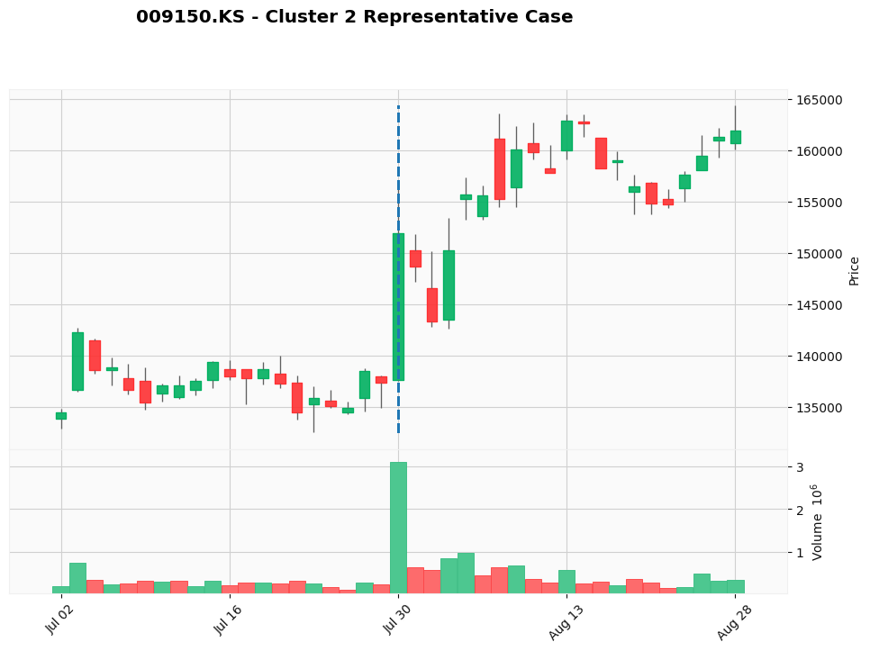
</p>
<p align="center"><b>Figure 5. Cluster 2 Representative Case</b></p>

위 차트는 거래량 증가와 가격 상승이 동시에 나타나는 사례를 보여준다. Cluster 2는 단순한 거래량 급증이 아니라 수급 유입이 가격 상승으로 연결된 패턴으로 해석할 수 있다.

---

## 9.8 Cluster 1: 차익실현 압력형

Cluster 1은 세 군집 중 가장 많은 데이터를 포함하며, 윗꼬리 관련 지표가 두드러지게 높게 나타났다.

| 주요 특징                    |      값 |
| ------------------------ | -----: |
| `upper_shadow_ratio`     |  0.508 |
| `upper_shadow_streak_5d` |  2.937 |
| `body_ratio`             | 11.402 |

`upper_shadow_ratio = 0.508`은 캔들 전체 길이의 절반 이상이 윗꼬리임을 의미한다.
`upper_shadow_streak_5d = 2.937`은 최근 5일 중 평균 약 3일 동안 긴 윗꼬리가 반복적으로 나타났음을 의미한다.

이는 장중 강한 매수세가 유입되었지만, 고점 부근에서 매도 압력이 반복적으로 발생했음을 시사한다.

### 대표 사례

대표 사례인 `207940.KS`는 `upper_shadow_ratio = 1.0`, `upper_shadow_streak_5d = 5`로 나타났다.

이는 최근 5일 동안 윗꼬리가 연속적으로 관찰되었음을 의미하며, 고점 부근에서 매도 압력이 반복적으로 발생하는 Cluster 1의 특성과 부합한다.

<p align="center">
  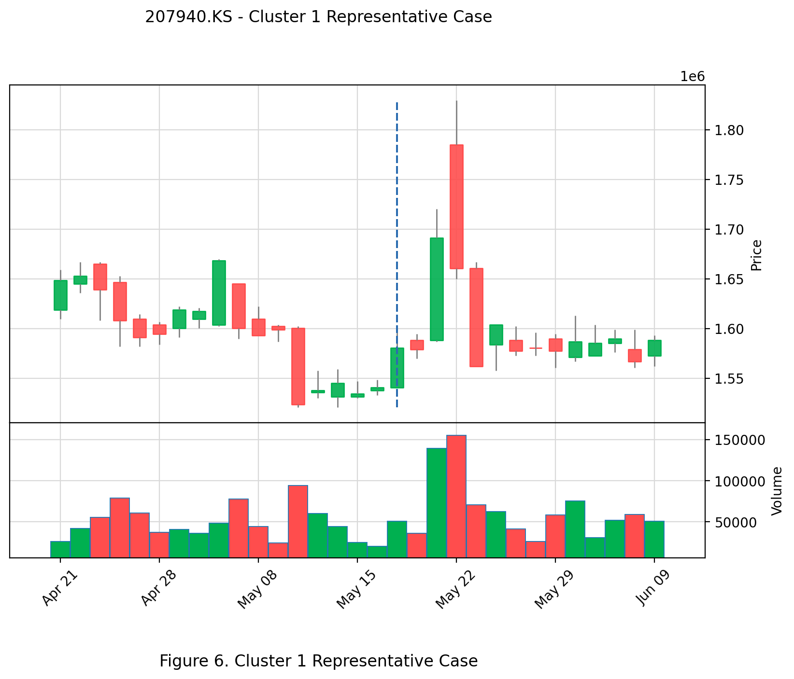
</p>
<p align="center"><b>Figure 6. Cluster 1 Representative Case</b></p>

위 차트는 최근 5일 동안 윗꼬리가 반복적으로 관찰된 사례를 보여준다. Cluster 1은 장중 고점 형성 이후 매도 압력이 반복적으로 나타나는 차익실현 압력형 패턴으로 해석할 수 있다.

---

## 9.9 Cluster 0: 주가 급락 및 특수 패턴형

Cluster 0은 일반적인 거래량 급증형이나 윗꼬리 반복형과 구분되는 특이 군집이다. 아래 수치는 표준화 스케일 기준의 군집 특징을 나타낸다.

| 주요 특징 (표준화 스케일 기준)       |      값 |
| :----------------------- | -----: |
| `drawdown_after_peak_5d` | -0.289 |
| `upper_shadow_ratio`     | -8.013 |
| `body_ratio`             |  8.505 |

`drawdown_after_peak_5d`가 음수로 나타난다는 것은 최근 고점 대비 하락폭이 존재한다는 의미이다. 또한 `body_ratio`가 높게 나타나므로, 장중 가격 변동이 캔들 몸통에 크게 반영된 패턴으로 해석할 수 있다.

이 군집은 고점 형성 이후 단기적으로 강한 가격 조정이 나타난 사례들을 포함할 가능성이 있다. 다만 다른 군집에 비해 해석의 불확실성이 존재하므로, 단독 투자 판단보다는 **시장 감시 및 심층 모니터링 후보군**으로 활용하는 것이 적절하다.

---

## 9.10 Feature Importance

<p align="center">
  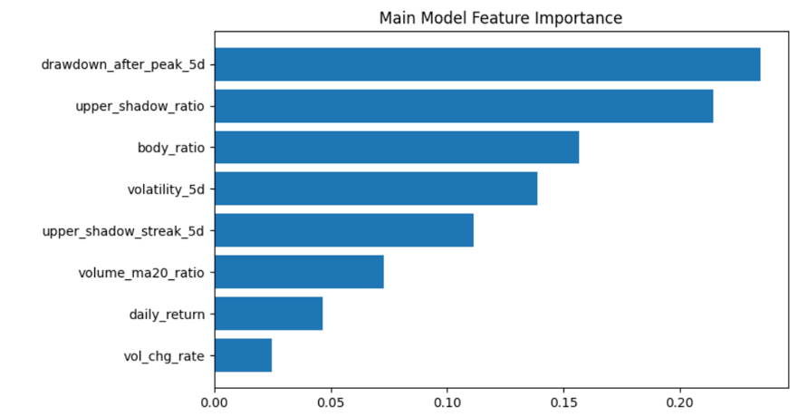
</p>
<p align="center"><b>Figure 7. Main Model Feature Importance</b></p>

Main Model V1의 군집 레이블을 Random Forest로 예측하도록 학습한 뒤, Feature Importance를 분석하였다.

분석 결과 군집 구분에는 `drawdown_after_peak_5d`, `upper_shadow_ratio`, `body_ratio`가 가장 큰 영향을 미쳤다. 이는 이상 거래 패턴을 설명할 때 거래량 자체보다 고점 이후 하락폭과 캔들 형태 같은 가격 행동 피처가 더 중요하게 작용했음을 의미한다.

| 중요 변수                    | 의미        |
| ------------------------ | --------- |
| `drawdown_after_peak_5d` | 고점 이후 하락폭 |
| `upper_shadow_ratio`     | 윗꼬리 비율    |
| `body_ratio`             | 캔들 몸통 비율  |

이를 통해 비정상 거래 패턴을 설명할 때 거래량 자체보다 **고점 이후 하락폭과 캔들 형태 같은 가격 행동 피처**가 더 중요한 역할을 한다는 점을 확인하였다.

---

# 10. Main Model V2

## 10.1 모델 개요

Main Model V2는 V1과 동일하게 Isolation Forest로 이상치를 탐지하되, DBSCAN 노이즈 제거 단계를 제외하고 바로 KMeans를 적용한 모델이다.

이 모델은 다음 질문을 확인하기 위한 비교 모델이다.

> **“DBSCAN 노이즈 제거 단계가 실제로 군집화 해석력 향상에 기여하는가?”**

---

## 10.2 모델 구조

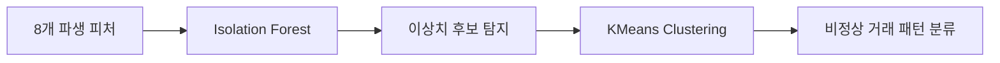
```mermaid
flowchart LR
    A[8개 파생 피처] --> B[Isolation Forest]
    B --> C[이상치 후보 탐지]
    C --> D[KMeans Clustering]
    D --> E[비정상 거래 패턴 분류]
```

---

## 10.3 V1과 V2의 차이

| 구분            | 구조                   | 입력 이상치 수 | 특징                  |
| ------------- | -------------------- | -------: | ------------------- |
| Main Model V1 | IF → DBSCAN → KMeans |     600개 | 노이즈 제거 후 핵심 이상치 군집화 |
| Main Model V2 | IF → KMeans          |   1,272개 | 노이즈 포함 상태로 군집화      |

V2에서는 K 탐색 결과 K=2에서 Silhouette Score가 높게 나타나 K=2를 최종 선택하였다.

그러나 DBSCAN 정제 없이 1,272개의 이상치를 모두 군집화하기 때문에 다양한 패턴이 하나의 군집 내부에 혼재될 가능성이 있다.

---

## 10.4 Main Model V2 해석

Main Model V2는 Validation/Test Silhouette Score가 V1보다 높게 나타나는 구간이 있었다.

하지만 이는 노이즈를 포함한 상태에서 군집 간 거리를 계산한 결과일 수 있다.

반면 Main Model V1은 이상치 중 약 53%를 노이즈로 제거하고, 패턴이 유사한 핵심 이상치만 군집화하였다. 따라서 군집 수치 자체보다 각 군집이 명확한 경제적 해석을 가진다는 점에서 V1이 더 적합하다고 판단하였다.

---

# 11. 모델 최종 선택 및 결과

## 11.1 Silhouette Score 비교

<p align="center">
  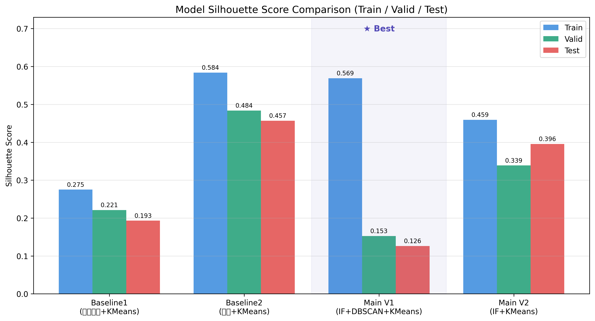
</p>
<p align="center"><b>Figure 8. Model Silhouette Score Comparison</b></p>

전체 모델 비교 결과 Baseline 2와 Main Model V2가 Validation/Test에서 더 높은 Silhouette Score를 보였다. 그러나 본 프로젝트의 목적은 단순히 군집 점수를 높이는 것이 아니라, 비정상 거래 패턴을 해석 가능한 유형으로 분류하는 것이므로 최종 모델은 Main Model V1로 선정하였다.

| 모델            | Train Silhouette | Validation Silhouette | Test Silhouette | 이상치 처리 방식                 |
| ------------- | ---------------: | --------------------: | --------------: | ------------------------- |
| Baseline 1    |            0.275 |                 0.221 |           0.193 | Z-score 97%               |
| Baseline 2    |            0.584 |                 0.484 |           0.457 | 없음, 전체 군집화                |
| Main Model V1 |            0.569 |                 0.153 |           0.126 | Isolation Forest + DBSCAN |
| Main Model V2 |            0.459 |                 0.339 |           0.396 | Isolation Forest          |

---

## 11.2 왜 Main Model V1을 최종 모델로 선택했는가?

Baseline 2는 Train, Validation, Test에서 상대적으로 높은 Silhouette Score를 보였다.

그러나 Baseline 2는 전체 데이터를 바로 KMeans로 군집화했기 때문에, 대다수를 차지하는 일반 거래 데이터가 하나의 군집으로 묶이면서 점수가 높게 나타난 측면이 있다.

즉, 높은 Silhouette Score가 반드시 본 프로젝트 목적에 가장 적합한 모델임을 의미하지 않는다.

본 프로젝트의 핵심 목적은 다음과 같다.

> **비정상 거래를 단순 탐지하는 것이 아니라, 탐지된 이상 거래를 의미 있는 패턴으로 유형화하고 해석하는 것**

이 기준에서 Main Model V1은 다음 장점을 가진다.

* 거래량 하나가 아닌 8개 피처를 동시에 고려한다.
* Isolation Forest를 통해 다변수 이상치를 탐지한다.
* DBSCAN으로 노이즈를 제거하여 군집 순도를 높인다.
* KMeans를 통해 이상 거래를 세 가지 유형으로 구분한다.
* Feature Importance를 통해 군집 구분 요인을 설명할 수 있다.

따라서 Main Model V1은 가장 높은 일반화 점수를 보인 모델은 아니지만, **비정상 거래 패턴의 유형화와 해석이라는 목적에 가장 적합한 모델**로 판단하였다.

---

## 11.3 모델별 역할 정리

| 모델         | 핵심 설계                | 발견 패턴                 | 한계                       |
| ---------- | -------------------- | --------------------- | ------------------------ |
| Baseline 1 | 거래량 Z-score → KMeans | 수급 유입형, 차익실현형, 소수 특수형 | 단일 변수 기반으로 맥락 구분 어려움     |
| Baseline 2 | 전체 KMeans            | 일반 거래, 거래량 증가, 극단 패턴  | 일반 거래가 대부분을 차지하여 세분화 어려움 |
| Main V1    | IF → DBSCAN → KMeans | 수급 유입, 차익실현, 특수 거래 패턴 | DBSCAN eps 민감도 존재        |
| Main V2    | IF → KMeans          | V1 비교용 이상 거래 군집       | 노이즈 포함으로 해석력 낮음          |

---

# 12. 군집별 대응 방안 및 활용 방안

## 12.1 Cluster 1: 차익실현 압력형

Cluster 1은 윗꼬리 비율과 윗꼬리 반복 횟수가 높은 특징을 보인다.

이는 장중 강한 매수세가 유입되더라도 고점 부근에서 매도 압력이 반복적으로 발생하고 있음을 의미한다.

### 활용 방안

* 투자 위험 경고 신호로 활용
* 단기 과열 여부 모니터링
* 반복 출현 시 신규 매수 신중 검토
* 보유 종목의 경우 분할 매도 시점 참고 자료로 활용

---

## 12.2 Cluster 2: 강한 수급 유입형

Cluster 2는 거래량 증가와 가격 상승이 동시에 나타나는 패턴이다.

시장 관심이 집중되는 종목에서 나타날 수 있으며, 단기 상승 흐름을 보여주는 후보군으로 볼 수 있다.

### 활용 방안

* 투자 기회 탐색 후보군 선별
* 거래량 증가의 지속 여부 모니터링
* 추가적인 기업 정보 및 뉴스 분석 수행
* 추세 지속 가능성 평가를 위한 보조 지표로 활용

다만 거래량 증가가 반드시 지속적인 상승을 의미하는 것은 아니므로, 단독 투자 판단 기준으로 사용해서는 안 된다.

---

## 12.3 Cluster 0: 특수 거래 패턴형

Cluster 0은 고점 대비 하락폭이 크고 일반적인 패턴과 구별되는 특성을 보인다.

군집 규모가 상대적으로 작고 특수 사례의 비중이 높아 해석의 불확실성이 존재한다.

### 활용 방안

* 심층 분석 대상 종목 선별
* 급락 이후 반등 여부 모니터링
* 뉴스, 공시, 수급 정보와 결합한 추가 분석 수행
* 투자 의사결정보다는 이상 징후 탐색 용도로 활용

---

## 12.4 모니터링 시스템으로의 활용

Main Model V1은 매일 생성되는 OHLCV 데이터에 적용하여 비정상 거래 패턴을 자동 탐지하는 모니터링 시스템으로 활용할 수 있다.

활용 흐름은 다음과 같다.

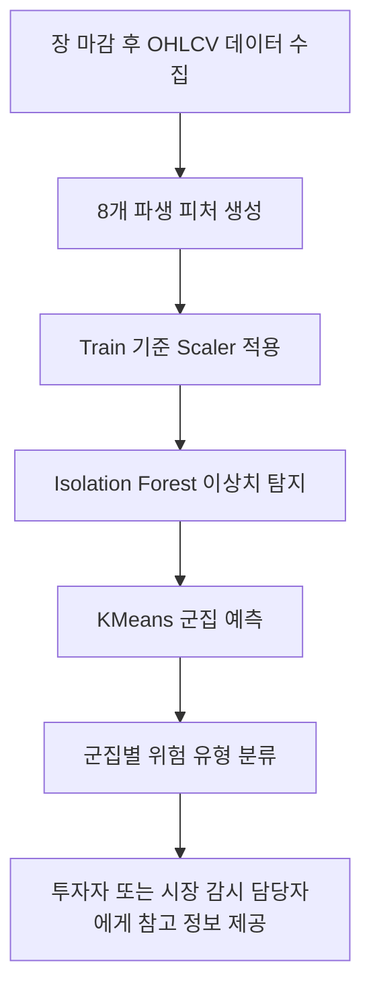
```mermaid
flowchart TD
    A[장 마감 후 OHLCV 데이터 수집] --> B[8개 파생 피처 생성]
    B --> C[Train 기준 Scaler 적용]
    C --> D[Isolation Forest 이상치 탐지]
    D --> E[KMeans 군집 예측]
    E --> F[군집별 위험 유형 분류]
    F --> G[투자자 또는 시장 감시 담당자에게 참고 정보 제공]
```

이를 통해 투자자는 단순한 거래량 증가 여부가 아니라, 해당 종목이 어떤 위험 특성을 보이는지 사전에 확인할 수 있다.

---

# 13. 기대 효과

## 13.1 복합 행동 패턴 기반 위험 탐지

기존 거래량이나 수익률 단일 지표 분석과 달리, 본 프로젝트는 거래량·변동성·윗꼬리 패턴·고점 이후 하락폭 등을 동시에 고려한다.

이를 통해 보다 복합적인 이상 거래 패턴을 탐지할 수 있다.

---

## 13.2 투자자의 정보 비대칭 완화

개인 투자자는 기관이나 전문 투자자에 비해 정보 접근성이 낮다.

본 모델은 개인 투자자가 직접 확인하기 어려운 비정상 거래 패턴을 자동으로 탐지하고, 해당 종목이 어떤 위험 유형에 가까운지 설명할 수 있다.

---

## 13.3 설명 가능한 이상 거래 분석

단순히 “이상치입니다”라고 제시하는 모델은 실무적으로 활용하기 어렵다.

본 프로젝트는 이상치 여부뿐 아니라 다음과 같이 유형별 해석을 제공한다.

| 유형        | 의미                         |
| --------- | -------------------------- |
| 차익실현 압력형  | 고점 매도 압력이 반복되는 위험 패턴       |
| 강한 수급 유입형 | 거래량과 가격 상승이 동시에 나타나는 패턴    |
| 특수 거래 패턴형 | 고점 대비 하락폭이 크고 일반 패턴과 다른 사례 |

따라서 사용자는 모델 결과를 보다 직관적으로 이해할 수 있다.

---

## 13.4 시장 감시 및 리스크 관리 확장 가능성

본 모델은 개인 투자자뿐 아니라 증권사, 자산운용사, 거래소의 시장 감시 시스템에도 응용할 수 있다.

특정 종목이 반복적으로 이상 거래 군집에 포함될 경우 위험 모니터링 대상으로 지정하고, 추가적인 뉴스·공시·수급 분석과 연결할 수 있다.

---

## 13.5 다양한 도메인으로 확장 가능

본 프로젝트의 구조는 다음과 같다.

```text
이상 패턴 탐지 → 유형화 → 해석 → 대응 방안 제시
```

이 구조는 주식시장뿐 아니라 다음 분야에도 확장 가능하다.

* 가상자산 이상 거래 탐지
* 금융 사기 탐지
* 보험 사기 탐지
* 카드 이상 결제 탐지
* 시장 감시 시스템

---

## 14. 한계점 및 향후 개선 방향

### 14.1 프로젝트 한계점

1. **실제 불공정거래 여부 검증 불가 (비지도학습 기반)**

   * 본 연구는 정답 Label이 없는 비지도학습 기반 이상 패턴 탐지 모델이다. 따라서 도출된 군집은 실제 작전주나 시세조종 여부를 확정하는 것이 아니라, 금융 시장의 통계적 의심 패턴 및 위험 징후로 해석해야 하는 한계가 있다.

2. **외부 정보(뉴스 및 공시) 반영의 한계**

   * 현재 모델은 주가(OHLCV) 데이터와 이를 기반으로 생성된 기술적 지표만을 활용한다. 이로 인해 기업의 깜짝 실적 발표, 정부 정책 수혜, 대규모 공급 계약 공시, M&A 등 호재성 이벤트로 인한 정상적인 거래량 급증과 비정상적인 작전성 패턴을 완전히 분리하기 어렵다.

3. **DBSCAN 파라미터 및 시장 환경 민감도**

   * 메인 모델인 DBSCAN은 반경(`eps`) 파라미터 설정에 따라 군집의 수와 노이즈 비율이 크게 변동한다. 국내 주식 시장의 전반적인 변동성과 유동성은 주기적으로 변화하므로, 고정된 파라미터가 아닌 시장 환경 변화에 따른 주기적인 재조정(Re-calibration) 프로세스가 필요하다.

### 14.2 향후 개선 방향

1. **정형/비정형 데이터의 결합 (뉴스 및 공시 데이터 반영)**

   * 자연어 처리(NLP) 기술을 도입하여 해당 거래일 전후의 뉴스 감성 분석 결과나 주요 공시 발생 여부를 피처로 결합할 수 있다. 이를 통해 단순 기술적 지표만으로는 구분하기 어려운 원인 있는 상승과 이유 없는 폭등을 보다 명확히 구분할 수 있다.

2. **실제 불공정거래 및 경보 종목 데이터 기반 검증**

   * 금융감독원 제재 사례, 한국거래소(KRX)의 투자주의·투자경고·투자위험 지정 종목 과거 데이터를 추가 수집하여, 본 모델이 탐지해낸 의심 군집과의 교집합 및 탐지율을 정량적으로 교차 검증할 수 있다.

3. **도메인 특화 피처 확장 및 패턴 유형 사전 고도화**

   * 기관/외국인 수급 정보, 공매도 잔고 추이, 호가창 잔량 변수 등 금융 도메인에 특화된 피처를 추가하여 군집 간 변별력을 높일 수 있다. 나아가 본 연구로 정의된 군집들을 바탕으로 **패턴 유형 사전(Pattern Dictionary)**을 구축하여, 향후 신규 종목의 이상 징후를 실시간으로 분류·매칭하는 모니터링 시스템으로 확장할 수 있다.

---

# 15. Repository Structure

```bash
financial-anomaly-detection
│
├── data
│   └── processed
│       ├── anomaly_cluster_result.csv
│       ├── cluster_profile_raw.csv
│       ├── cluster_profile_scaled.csv
│       ├── test_features.csv
│       ├── train_features.csv
│       └── valid_features.csv
│
├── notebooks
│   ├── 01_Step1_Data.ipynb
│   ├── 01_Step2_Data.ipynb
│   ├── 01_Step3_Data.ipynb
│   ├── 01_Step4_Data.ipynb
│   ├── 02_Baseline_1.ipynb
│   ├── 03_Baseline_2.ipynb
│   └── 04_Main_model.ipynb
│
├── results
│   └── figures
│       ├── baseline1_01_anomaly_detection_scatter.png
│       ├── baseline1_02_cluster_feature_barplot.png
│       ├── baseline1_04_silhouette_comparison.png
│       ├── baseline2_01_pca_cluster_scatter.png
│       ├── baseline2_02_silhouette_comparison.png
│       ├── cluster1_representative_case.png
│       ├── cluster2_representative_case.png
│       ├── eda2_volume_distribution.png
│       ├── eda3_volatility_distribution.png
│       ├── eda4_volume_vs_volatility_en.png
│       ├── eda5_candlestick_anomaly_en.png
│       ├── eda6_feature_correlation_en.png
│       ├── eda7_anomaly_existence_en.png
│       ├── final_model_silhouette_comparison.png
│       ├── main_01_if_score_distribution.png
│       └── main_model_feature_importance.png
│
├── .gitignore
├── LICENSE
└── README.md
```

---

# 16. How to Run

## 16.1 Repository Clone

```bash
git clone https://github.com/leessanghu/financial-anomaly-detection.git
cd financial-anomaly-detection
```

---

## 16.2 패키지 설치

아래 패키지가 필요하다.

```bash
pip install pandas numpy matplotlib seaborn scikit-learn yfinance
```

사용 환경에 따라 추가 패키지가 필요할 수 있다.

---

## 16.3 노트북 실행 순서

노트북은 다음 순서대로 실행하는 것을 권장한다.

| 순서 | 파일명 | 설명 |
| -: | --- | --- |
| 1 | `01_Step1_Data.ipynb` | 원천 데이터 수집 및 기본 데이터 구성 |
| 2 | `01_Step2_Data.ipynb` | 시계열 Train/Validation/Test 분할 |
| 3 | `01_Step3_Data.ipynb` | EDA 및 이상 분포 확인 |
| 4 | `01_Step4_Data.ipynb` | 8개 파생 피처 생성 |
| 5 | `02_Baseline_1.ipynb` | Baseline 1 실험 |
| 6 | `03_Baseline_2.ipynb` | Baseline 2 실험 |
| 7 | `04_Main_model.ipynb` | Main Model 학습, 군집화 결과 해석 및 최종 비교 |

---

# 17. References

## Data Source

* Yahoo Finance
* yfinance Python package

## Libraries

* pandas
* numpy
* matplotlib
* seaborn
* scikit-learn
* yfinance

## Methodology

* Z-score based anomaly detection
* Isolation Forest
* DBSCAN
* KMeans Clustering
* Random Forest Feature Importance
* Silhouette Score

---

# 18. Caution

본 프로젝트는 데이터마이닝 수업의 Term Project로 수행된 연구이며, 실제 투자 자문이나 매매 추천을 목적으로 하지 않는다.

모델이 탐지한 이상 거래 패턴은 투자 판단을 위한 보조 정보로만 활용해야 하며, 실제 투자 의사결정에는 기업의 재무 정보, 뉴스, 공시, 시장 상황 등 다양한 요소를 함께 고려해야 한다.

---

# Conclusion

본 프로젝트는 주식시장에서 발생하는 거래량 급증 현상을 단순한 투자 신호로 해석하는 것이 아니라, 데이터마이닝 기법을 활용하여 비정상 거래 패턴으로 세분화하고 해석하고자 하였다.

분석 결과, 거래량만으로는 위험 패턴을 충분히 설명하기 어렵고, 고점 이후 하락폭, 윗꼬리 비율, 캔들 몸통 비율과 같은 가격 행동 피처가 비정상 거래 유형을 구분하는 데 중요한 역할을 한다는 점을 확인하였다.

최종적으로 Isolation Forest, DBSCAN, KMeans를 결합한 Main Model V1은 비정상 거래를 다음 세 가지 유형으로 분류하였다.

| Cluster   | 유형        | 핵심 의미                  |
| --------- | --------- | ---------------------- |
| Cluster 0 | 특수 거래 패턴형 | 고점 대비 하락폭이 큰 특수 패턴     |
| Cluster 1 | 차익실현 압력형  | 윗꼬리 반복과 고점 매도 압력       |
| Cluster 2 | 강한 수급 유입형 | 거래량과 가격 상승이 함께 나타나는 패턴 |

본 프로젝트는 비지도학습을 활용해 금융시장의 비정상 거래 패턴을 탐지하고 해석하는 하나의 실험적 접근이다.

향후 뉴스·공시·수급 데이터와 결합한다면 보다 정교한 시장 위험 모니터링 시스템으로 확장될 수 있다.
